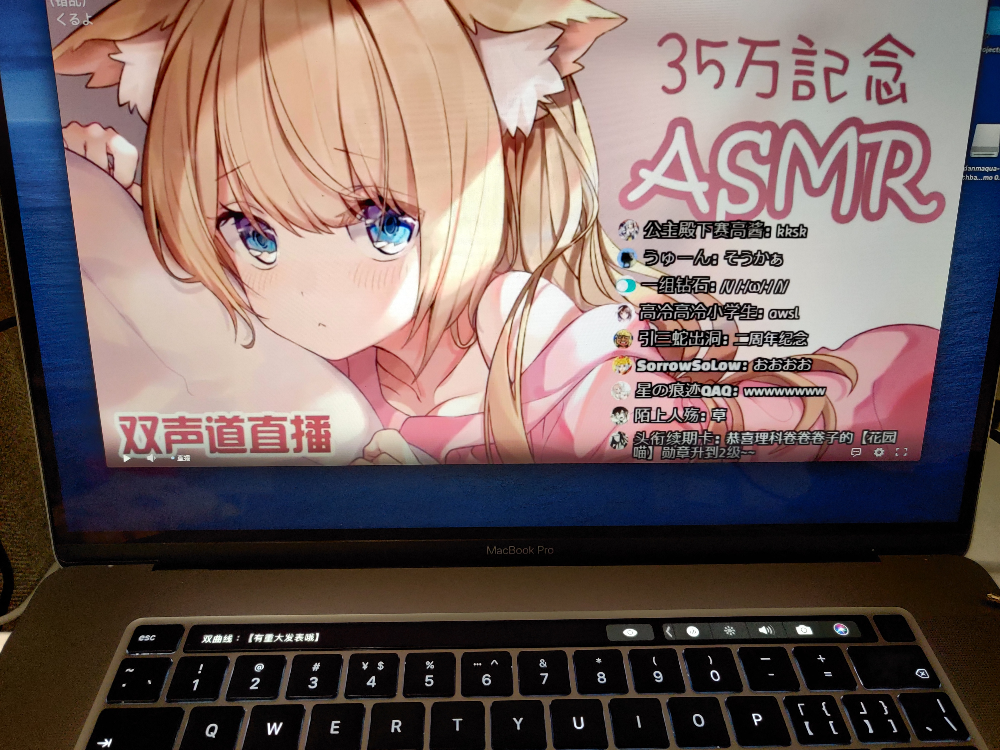

danmaqua-touchbar-demo
======

Just for fun :P

**演示视频**：

## 这是什么

</img>

在你的 MacBook Pro with Touch Bar 上利用 Touch Bar 屏幕显示 VTuber 直播中的同传翻译弹幕。

尽管这是一个 Electron 应用，但仅在 macOS Catalina 10.15+ 上测试过，在其他操作系统上 Electron 框架也无法为你调用 Touch Bar API。

## 如何使用

Git Clone 本项目下来，在机器上安装 Node.js 12+ 后，执行 `npm install` 安装项目所需的依赖。

然后执行 `npm run dev` 启动 Electron 调试运行。

或者你可以试试安装 [GitHub Releases](https://github.com/danmaqua/danmaqua-touchbar-demo/releases) 中未签名的预编译包。

## 感谢

这个玩具的大部分功能实现依赖于这些第三方开源库，感谢开发者们的付出：

- UI 框架 / Touch Bar API Wrapper：[Electron](https://github.com/electron/electron)
- 哔哩哔哩弹幕协议：[bilibili-live-ws](https://github.com/simon300000/bilibili-live-ws)
- 播放界面：[DPlayer](https://github.com/MoePlayer/DPlayer)
- FLV HTML5 实现：[flv.js](https://github.com/Bilibili/flv.js)

其他依赖请参考 `package.json` 文件声明。

## Licenses

哔哩哔哩直播与弹幕协议版权归上海幻电信息科技有限公司所有，本项目仅供学习交流所使用，请勿作商业用途。

项目代码没有选择任何开源协议的情况下公开，你可以基于这个 Idea 去开发，随心使用，能带上来源标注就更好了。
